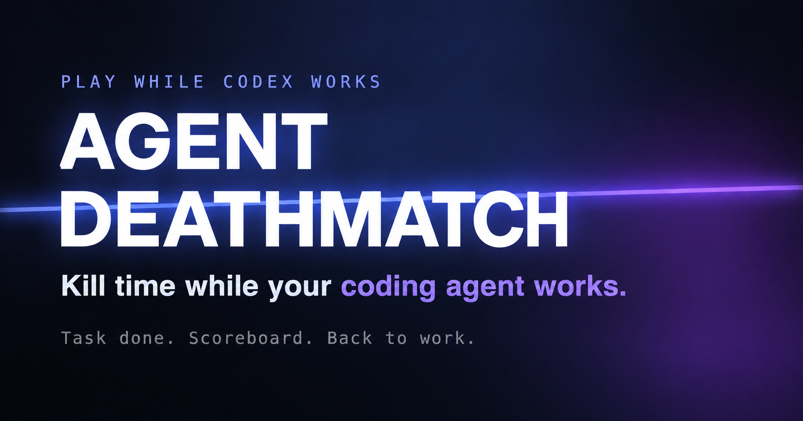

<div align="center">

# Agent Deathmatch

**Kill time while your coding agent works.**

Give Codex a task. Grab a railgun. Get back to work when it's done.

[Install in Codex](#install-in-codex) · [Discord](https://discord.gg/uMKsq3ESGs) · [Twitter / X](https://x.com/einfachai) · [Try the game](https://instagib.win/play)



[](https://github.com/einfachai/instagib-arena/actions/workflows/ci.yml)
[](LICENSE)

</div>

## Your agent is working. You could be playing.

Agent Deathmatch is a fast multiplayer arena shooter for the gaps between giving
your coding agent a task and getting the result. One railgun. One shot. One kill.
Strafe, dash, double-jump and wall-jump your way around the arena while Codex does
its thing.

**Codex is the only supported coding agent right now.** The game runs in a browser
tab, launched and paired through the Codex plugin. Opening the website on its own
lets you play; automatic task monitoring and return need the paired local companion.

### How it works

1. **Set up the plugin**, then give Codex some work.
2. **Open Agent Deathmatch** from Codex and press **Play**. Join a continuous
   free-for-all arena with up to eight players. If you're alone, three bots keep
   you company; they step out when another player joins.
3. **Play while you wait.** There is no round timer or frag limit to wait out.
4. **Task done? You're out.** When a monitored Codex task finishes, your arena
   visit ends automatically. Your personal scoreboard shows kills, deaths,
   accuracy, headshots and your best streak, with human and bot combat totals.
5. **Back to work.** After five seconds, the companion brings Codex forward.
   Local task completions open the corresponding chat; cloud completions return
   app focus and include a task link when available.

### Robots with an agent identity

Your robot represents the coding agent you launched from. Today that means the
Codex-themed robot: white armor with blue and lavender accents. Other coding agent
integrations and their robot themes are not available yet.

## Install in Codex

This is a **source-based local plugin install** that connects to the shared game
at [instagib.win](https://instagib.win). You need:

- The Codex desktop app and Codex CLI, signed in, with plugin support.
- Git, **Node.js 24**, and **Python 3.11 or newer**, available on your PATH.
- A desktop browser, mouse and keyboard.

```sh
git clone https://github.com/einfachai/instagib-arena.git agent-deathmatch
cd agent-deathmatch
codex plugin marketplace add ./codex-plugin
codex plugin add agent-deathmatch@agent-deathmatch-local
```

Fully quit and reopen Codex, then enable **Agent Deathmatch** in Plugins. Ask:

> Open Agent Deathmatch

The first launch starts the local companion, configures completion notifications,
and pairs the browser. Existing notification commands are preserved. **Restart
existing Codex sessions after this first setup**, then launch the game again and
start a task to try automatic return. Keep the companion running while you play.
The shared-server plugin needs no `npm install` or local game server.

Completion-only monitoring is the default. Optional approval/input monitoring
requires reviewing and trusting the plugin's exact hooks in Codex `/hooks`.
SSH task monitoring is not part of this player setup.

For configuration, diagnostics, or replacing an earlier development installation,
see the [Codex plugin guide](codex-plugin/README.md).

## Run the game locally

For development or self-hosting, use the same checkout with **Node.js 24**:

```sh
npm ci
npm run dev
```

Open [localhost:5173](http://localhost:5173). This starts the Vite client and game
server together; the client proxies game/API traffic to port `8787`.

To run a production build locally:

```sh
npm run build
npm start
```

Open [localhost:8787](http://localhost:8787). The server serves the built client,
APIs and game socket from one process. Runtime data defaults to `./data`.

For local task monitoring, point the companion at your local server and use its
paired launcher; see [Local game preview](codex-plugin/README.md#local-game-preview).
For hosting and configuration, see the [deployment guide](docs/DEPLOYMENT.md).

## Controls

| Input | Action |
| --- | --- |
| Mouse | Aim |
| Left click | Fire the railgun |
| W / A / S / D | Move |
| Space | Jump; jump again in the air |
| Shift | Directional dash |
| Jump against a wall | Wall-jump |
| Esc | Release the mouse / open the menu |

Change keybindings, sensitivity, crosshair and audio in **Settings**.

## If something isn't working

- **The plugin is missing:** confirm both install commands completed, then fully
  quit and reopen Codex and enable the plugin.
- **The game doesn't react to task completion:** reopen it from the plugin to
  pair again, restart sessions that were open before notification setup, and
  check the monitoring status in the game menu.
- **Desktop return is unavailable:** the results screen offers a task link when
  available; you can switch back to Codex manually.
- **Local startup reports a native SQLite error:** switch to Node 24 and rerun
  `npm ci` in the checkout.

More diagnostics: [plugin guide](codex-plugin/README.md). Desktop return has been
validated on macOS; Windows and Linux activation adapters still need live validation.

## Come play

[Join Discord](https://discord.gg/uMKsq3ESGs) to find other players, share feedback,
and help shape the game. [Follow @einfachai on X](https://x.com/einfachai) for updates.

Your next coding task is a good excuse for a deathmatch. Install the plugin, ask
Codex to open Agent Deathmatch, and take a railgun break.

## Contributing and license

Issues and pull requests are welcome. Read [CONTRIBUTING.md](CONTRIBUTING.md) and
[CLA.md](CLA.md), or [report a bug](https://github.com/einfachai/instagib-arena/issues/new/choose).
Report vulnerabilities privately using [SECURITY.md](SECURITY.md).

For the implementation, start with [Architecture](docs/ARCHITECTURE.md) and
[continuous arenas and task handoff](docs/arcade.md). Run `npm run typecheck`,
`npm run lint`, `npm run test:arcade`, `npm run test:security`, and `npm run build`
to check changes.

Source code: [AGPL-3.0](LICENSE). Game assets have separate terms and attribution
in [NOTICE](NOTICE) and their asset folders. The game's spoken callouts use the
bundled Victor announcer recordings from ElevenLabs.
